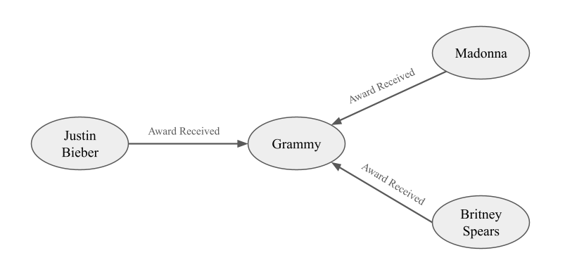

# Mitigation of Hallucination in LLMs

In this project, we conducted a comparative study of techniques to reduce unsupported or "hallucinated" outputs in LLMs.

As LLMs are increasingly used for various tasks, they can produce answers that sound convincing and confident, but may be factually incorrect or generate unfounded content.

We explored and benchmarked several mitigation strategies aimed to:

1. Understand existing evaluation metrics and explore additional reliable evaluation tools.
2. Study implementation details and quantify accuracy/hallucination improvements across methods.

## Architecture

The diagram above summarizes the full pipeline: the WebQuestions dataset and Wikidata knowledge graph are
preprocessed independently, used to fine-tune Gemma-2B with LoRA and augment it with KG embeddings, and both
variants are evaluated against the base model using BLEU, ROUGE, WACK (Adversarial Prompting), and HaluEval (LLM as a Judge).

## Model

For this project, we used **Gemma-2B**, a lightweight open-source transformer-based LLM, as the base model for all methods.
Its size makes it well suited for rapid experimentation and parameter-efficient fine-tuning while still maintaining
reasonable generalization.

Experiments were run on an **NVIDIA A100 GPU**.

## Dataset

We used **Stanford's WebQuestions**, a question-answer benchmark derived from Freebase, containing natural-language
queries paired with factual answers.
Source: [Hugging Face Datasets](https://huggingface.co/datasets/stanfordnlp/web_questions)

- Training set: 3,022 Q/A pairs
- Test set: 756 Q/A pairs

## Methods

We implemented and compared two core strategies, plus a hybrid combination:

1. **Parameter-Efficient Fine-Tuning (LoRA)**
   We applied Low-Rank Adaptation (LoRA) to Gemma-2B, injecting trainable low-rank matrices into the key, query,
   value, and output projections of self-attention, as well as the gate, up-projection, and down-projection layers
   of the feed-forward blocks. This updates only a small subset of the model's 2B parameters, reducing compute and
   storage cost while specializing the model for factual QA. Implemented using Hugging Face's **`peft`** library.

2. **Knowledge Graph Grounding**
   We built a knowledge graph from **Wikidata**, mapping each WebQuestions item to its corresponding Wikidata
   entity (via Freebase ID → QID conversion) and extracting relevant (subject, predicate, object) triples via the
   Wikidata Query Service.
   The given image shows an example of how KG-RAG is structured:
   

   Triples were flattened into readable strings and embedded using the
   `all-mpnet-base-v2` sentence transformer. At inference, the top-5 most semantically similar triples (via cosine
   similarity) are retrieved and concatenated with the user query before generation — a lightweight,
   structured alternative to traditional text-based RAG.

   We combined LoRA fine-tuning with KG-based retrieval to test whether the two methods complement each other,
   grounding the fine-tuned model's generation in retrieved, verifiable facts.

## Evaluation

We used a combination of lexical and hallucination-specific metrics:

- **BLEU / ROUGE (1, 2, L, Lsum)** — measure lexical/n-gram overlap with reference answers.
- **WACK (Wrong Answer Calibration Kit)** — distinguishes hallucination from ignorance by comparing accuracy on
  straightforward vs. adversarial (few-shot incorrect examples) prompts.
- **HaluEval** — LLM-as-judge hallucination evaluation, using ChatGPT-4.1-nano as the meta-evaluator.

### Key Results

| Metric                  | Base (Gemma-2B) | Fine-tuned (LoRA) | KG-embed   |
| ----------------------- | --------------- | ----------------- | ---------- |
| BLEU                    | 0.0043          | **0.1859**        | 0.0924     |
| ROUGE-1                 | 0.0651          | **0.3187**        | 0.2474     |
| ROUGE-L                 | 0.0628          | **0.3187**        | 0.2459     |
| WACK Hallucination Risk | 10.6%           | **7.1%**          | 8.1%       |
| HaluEval (Test set)     | 25.93%          | 25.93%            | **27.38%** |

- **LoRA fine-tuning** gave the largest gains in lexical alignment (BLEU/ROUGE) and reduced hallucination risk
  under adversarial prompting by ~33% (10.6% → 7.1%).
- **KG grounding** gave a modest boost in HaluEval correctness on unseen test data, but underperformed LoRA on
  lexical metrics. This is likely because retrieved triples introduce semantically relevant but lexically divergent
  context.
- Combining both did **not** yield consistent additional gains over LoRA alone, suggesting naive layering of
  mitigation strategies is insufficient and more principled integration (e.g., joint fine-tuning with KG retrieval)
  is needed.

## Discussion

A few key challenges and insights emerged during experimentation:

- **Ground-truth data quality matters.** While empty or null entries are easy to filter, outdated or incorrect
  answers in the dataset are much harder to catch and can meaningfully skew training and evaluation. For example,
  HaluEval flagged an outdated ground-truth answer for "Where is the head office of HSBC Bank?" (the dataset said
  New York City, though the correct current answer is London). Dataset freshness directly affects
  how reliable your training and evaluation results are.

- **Context matters as much as facts.** Models sometimes produced vague or off-target answers when given
  insufficient context. In one case, asked who voiced Anakin in _Star Wars: The Clone Wars_, a model answered
  "Anakin Skywalker". It got confused between the fictional character and the actual voice actor. This points to the need for
  both clean data and context-aware retrieval, not just more facts.

- **Combining strategies moves the needle.** Even though hallucinations remain an open challenge, combining prompt
  engineering, fine-tuning, retrieval-augmented generation, and structured grounding meaningfully improved factual
  reliability without sacrificing fluency. This shows that a multi-pronged approach is a promising and practical
  path forward, rather than relying on any single technique alone.

## Future Work

- Tighter integration between fine-tuning and KG retrieval (e.g., joint training rather than post-hoc augmentation)
- Experimenting with larger models and more diverse datasets to test generalization of mitigation strategies
- Exploring other RAG systems, such as Agentic RAG, to see if they can better leverage retrieved knowledge
- Filtering/ranking retrieved triples to reduce irrelevant context
- Reinforcement Learning from Human Feedback (RLHF) for factual alignment

## Authors

1. Gaurang Kamat
2. Benjamin Klassen
3. Alejandro Danies-Lopez
4. Jingyan (Joy) Xu

## References

1. SM Tonmoy, SM Zaman, Vinija Jain, Anku Rani, Vipula Rawte, Aman Chadha, and Amitava Das, "A comprehensive survey of hallucination mitigation techniques in large language models," arXiv preprint arXiv:2401.01313, vol. 6, 2024.
2. Garima Agrawal, Tharindu Kumarage, Zeyad Alghamdi, and Huan Liu, "Can knowledge graphs reduce hallucinations in llms?: A survey," arXiv preprint arXiv:2311.07914, 2023.
3. Gemma Team, Thomas Mesnard, Cassidy Hardin, Robert Dadashi, Surya Bhupatiraju, Shreya Pathak, Laurent Sifre, Morgane Rivière, Mihir Sanjay Kale, Juliette Love, et al., "Gemma: Open models based on gemini research and technology," arXiv preprint arXiv:2403.08295, 2024.
4. Muchen Huan and Jianhong Shun, "Fine-tuning transformers efficiently: A survey on lora and its impact," 2025.
5. Junyi Li, Xiaoxue Cheng, Wayne Xin Zhao, Jian-Yun Nie, and Ji-Rong Wen, "Halueval: A large-scale hallucination evaluation benchmark for large language models," 2023.
6. Long Ouyang, Jeffrey Wu, Xu Jiang, Diogo Almeida, Carroll Wainwright, Pamela Mishkin, Chong Zhang, Sandhini Agarwal, Katarina Slama, Alex Ray, et al., "Training language models to follow instructions with human feedback," Advances in neural information processing systems, vol. 35, pp. 27730–27744, 2022.
7. Patrick Lewis, Ethan Perez, Aleksandra Piktus, Fabio Petroni, Vladimir Karpukhin, Naman Goyal, Heinrich Küttler, Mike Lewis, Wen-tau Yih, Tim Rocktäschel, et al., "Retrieval-augmented generation for knowledge intensive nlp tasks," Advances in neural information processing systems, vol. 33, pp. 9459–9474, 2020.
8. Adi Simhi, Jonathan Herzig, Idan Szpektor, and Yonatan Belinkov, "Constructing benchmarks and interventions for combating hallucinations in llms," 2024.
